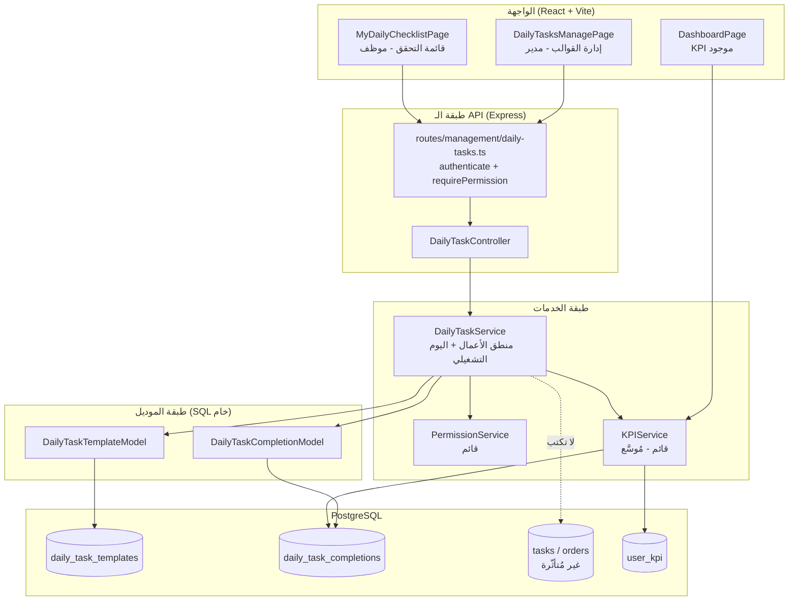
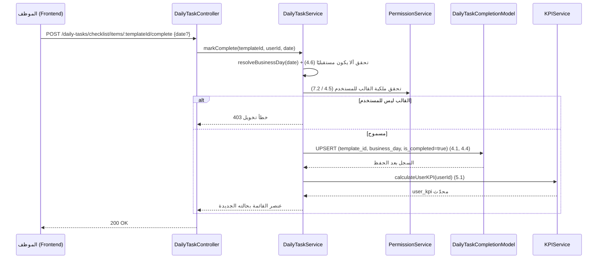
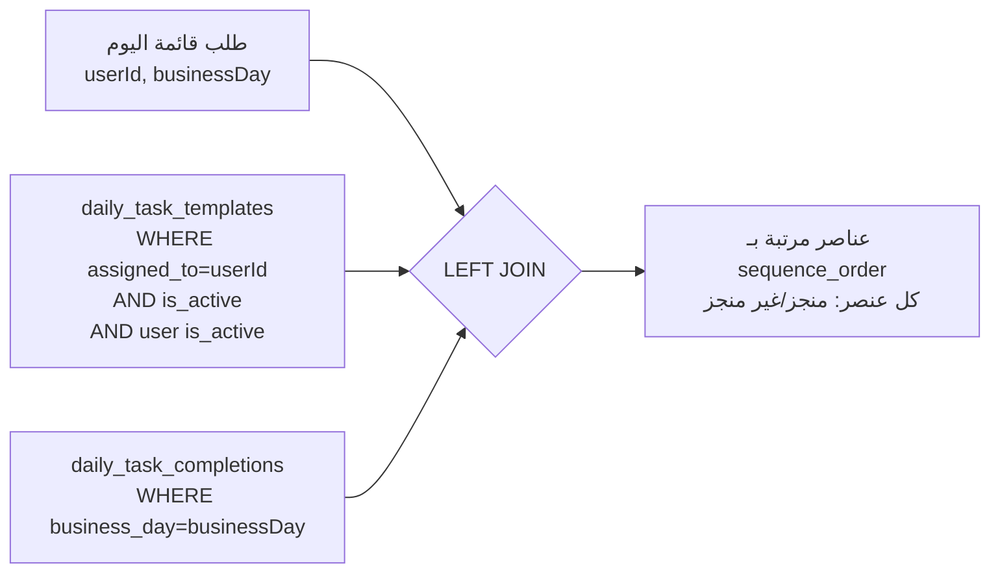
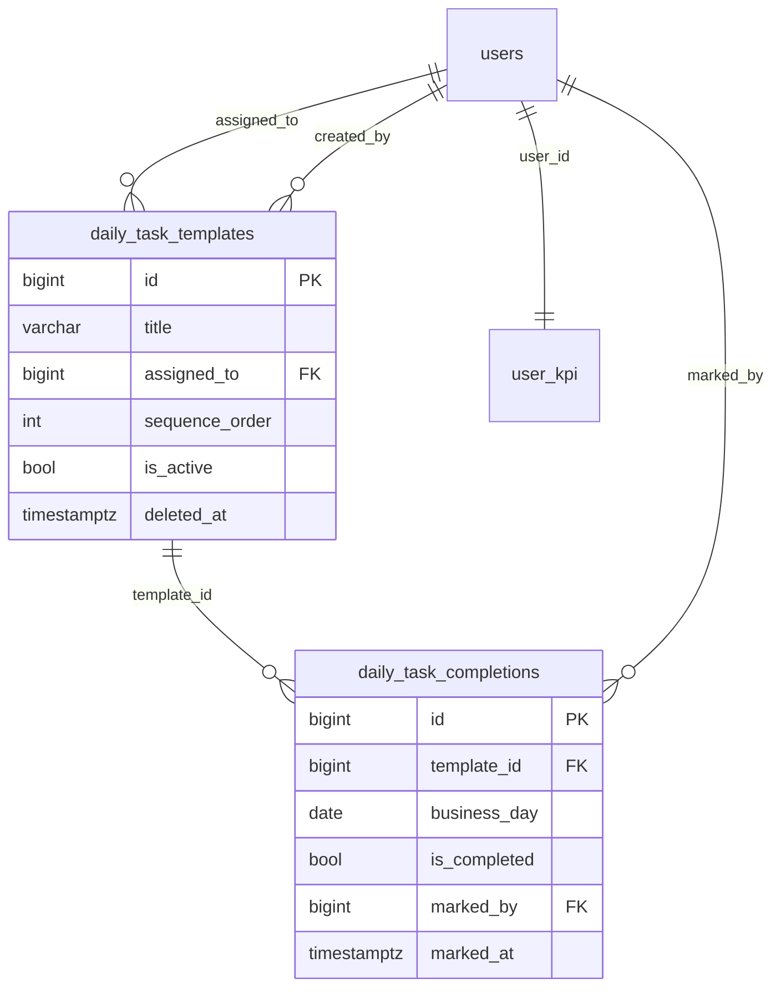
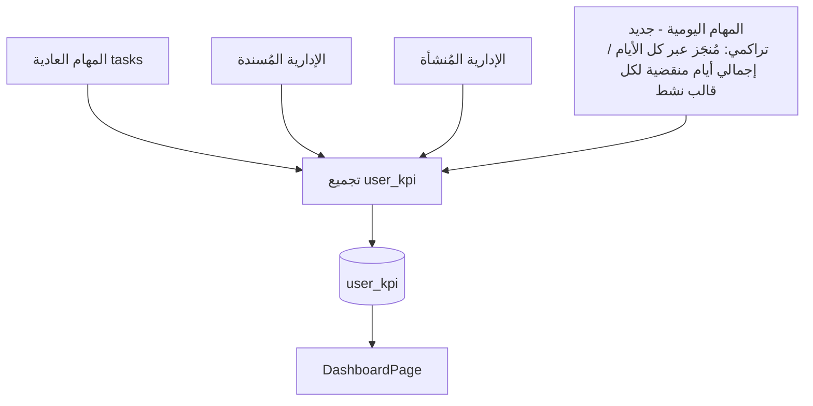

# وثيقة التصميم — المهام اليومية الثابتة (Recurring Daily Tasks)

## Overview

تصف هذه الوثيقة تصميم ميزة **المهام اليومية الثابتة** داخل نظام إدارة المركز الإعلامي (MCMS). الهدف هو السماح للمدير بتعريف مهمة يومية **مرة واحدة** كـ **قالب (Daily Task Template)** مُسند إلى موظف، ثم تظهر هذه المهمة تلقائيًا كل يوم لذلك الموظف على شكل **قائمة تحقق (Checklist)** قابلة للإنجاز، دون إعادة إنشائها يدويًا. وعند وضع علامة الإنجاز يُسجَّل الإنجاز **لذلك اليوم التشغيلي تحديدًا**، وينعكس مباشرة على مؤشرات الأداء (KPI).

تتقيّد الوثيقة بقيود جوهرية من المتطلبات:
- المهام اليومية **نوع منفصل تمامًا** عن المهام العادية، وتُخزَّن في **جداول مستقلة** عن جدول `tasks` وجداول الطلبات `orders` (Requirement 6).
- لا يجوز إنشاء/تعديل/حذف أي سجل في `tasks` أو `orders` نتيجة عمليات المهام اليومية (Requirement 6.2).
- يجب أن ينعكس إنجاز المهام اليومية على `user_kpi` **بالإضافة** إلى المهام العادية ودون استبدالها (Requirement 5).
- الصلاحيات تُدار عبر `PermissionService` القائم (Requirement 7).

### مبدأ التصميم الأساسي

القرار المعماري المحوري هو: **كيف نمثّل "تكرار يومي" لمهمة دون توليد بيانات ضخمة ومكررة كل يوم؟** هذه الوثيقة تحلّل المشكلة، تطرح عدة بدائل معمارية، تقارن بينها، ثم تختار وتبرّر الحل الأمثل بناءً على النظام القائم وقابلية التوسّع والأداء.

---

## تحليل المشكلة (Problem Analysis)

قبل اختيار التصميم، نحدّد الخصائص الجوهرية للمشكلة:

1. **القالب ثابت، والحالة متغيّرة يوميًا**: تعريف المهمة (العنوان، الموظف، الترتيب، التفعيل) لا يتغيّر يوميًا. ما يتغيّر هو **حالة الإنجاز لكل يوم**. هذا فصل طبيعي بين *تعريف* و*حدث*.

2. **الندرة (Sparsity)**: في أي يوم، قد لا يضع الموظف علامة على كل عناصره (أو على أيٍّ منها). معظم خلايا المصفوفة (قالب × يوم) ستكون "غير مُنجز". تخزين صف لكل (قالب × يوم) بشكل مسبق يعني توليد بيانات هائلة أغلبها فارغ.

3. **النمو غير المحدود زمنيًا**: الزمن لا نهائي. أي تصميم "ينشئ صفوفًا لكل يوم" ينمو خطيًا مع الزمن × عدد القوالب، بينما عدد القوالب نفسه صغير ومستقر.

4. **الاشتقاق الحتمي للقائمة**: قائمة التحقق ليوم ما = (القوالب المُفعّلة للموظف النشط) ⋈ (سجلات الإنجاز لذلك اليوم). أي أن القائمة يمكن **اشتقاقها** ولا يلزم **تخزينها**.

5. **عدم التكرار (Idempotency)**: وضع العلامة مرتين على نفس العنصر في نفس اليوم يجب ألّا ينشئ سجلين (Requirement 4.4).

6. **حدود اليوم التشغيلي**: تحديد "أي يوم" يخص سجل الإنجاز يعتمد على منطقة زمنية مرجعية ثابتة (Requirement 8.4).

من هذا التحليل يتّضح أن المشكلة في جوهرها **فصل التعريف (قالب ثابت) عن الحدث المتفرّق (إنجاز يوم محدد)**، مع اشتقاق العرض عند الطلب.

---

## البدائل المعمارية والمقارنة (Architecture Options & Comparison)

### الخيار أ: توليد صفوف يومية مادية (Daily Materialized Rows)

ينشئ النظام (عبر مهمة مجدولة cron) صفًا فعليًا لكل (قالب مُفعّل × موظف) في بداية كل يوم تشغيلي، في جدول مثل `daily_task_instances`، ويحمل كل صف حالة الإنجاز الخاصة به.

**المزايا:**
- استعلام قائمة اليوم بسيط: `SELECT ... WHERE business_day = $1 AND user_id = $2`.
- نموذج ذهني مباشر: "كل يوم له صفوفه".

**العيوب:**
- **نمو غير محدود**: عدد الصفوف = عدد القوالب × عدد الأيام. مع 40 موظفًا و~5 قوالب لكل موظف، ذلك ~200 صف/يوم → ~73,000 صف/سنة، أغلبها "غير مُنجز" (بيانات فارغة فعليًا).
- **اعتماد على مُجدوِل (cron/scheduler)**: يلزم وظيفة موثوقة تعمل عند حدّ منتصف الليل. فشلها يعني عدم ظهور قوائم اليوم (نقطة فشل تشغيلية). النظام الحالي لا يحتوي بنية مُجدولات راسخة لهذا الغرض.
- **مشاكل الأيام الفائتة**: ماذا لو لم يعمل المُجدول ليوم؟ أو طلب موظف يوم اليوم قبل تشغيله؟ يلزم منطق "توليد عند الطلب" احتياطيًا، ما يكرر التعقيد.
- **تكرار بيانات التعريف**: العنوان والترتيب يُنسخان (أو يُشار إليهما) في كل صف يومي.
- **تعقيد التغييرات المستقبلية**: تعديل/حذف/إعادة إسناد قالب "اعتبارًا من الغد" (Requirements 2.2, 2.4) يصبح أصعب لأن صفوف اليوم قد تكون وُلِّدت بالفعل.

### الخيار ب: قالب ثابت + سجل إنجاز لكل يوم (Template + Per-Day Completion Record) — **الخيار المختار**

نخزّن:
- **قالبًا واحدًا ثابتًا** لكل مهمة يومية في `daily_task_templates` (لا يتكرر زمنيًا).
- **سجل إنجاز واحدًا فقط عند وضع العلامة فعليًا** في `daily_task_completions`، مفتاحه (template_id, business_day).

قائمة التحقق اليومية تُشتق **عند الطلب** عبر LEFT JOIN بين القوالب المُفعّلة وسجلات إنجاز ذلك اليوم. الأيام بلا تسجيل لا تُولّد أي صفوف؛ تظهر عناصرها "غير مُنجز" تلقائيًا (Requirement 8.1).

**المزايا:**
- **تخزين متناسب مع العمل الفعلي فقط**: صف إنجاز يُنشأ فقط عندما يضع موظف علامة. لا بيانات فارغة.
- **لا مُجدول ولا نقطة فشل زمنية**: لا حاجة لوظيفة منتصف الليل. عبور حدّ اليوم يغيّر فقط قيمة `business_day` المحسوبة، فتظهر قائمة جديدة "غير مُنجزة" تلقائيًا (Requirement 8.5).
- **عدم التكرار طبيعي**: تعريف المهمة موجود مرة واحدة في القالب؛ السجلات تخزّن الحالة فقط.
- **idempotency مدمج**: قيد `UNIQUE(template_id, business_day)` + UPSERT يضمن عدم تكرار سجل اليوم (Requirement 4.4).
- **تغييرات "اعتبارًا من الغد" بسيطة**: التعطيل/الحذف المنطقي/إعادة الإسناد تؤثر على اشتقاق القائمة فورًا أو من اليوم التالي دون لمس بيانات تاريخية (Requirements 2.2, 2.4, 8.2, 8.6).
- **حِفظ السجلات التاريخية مضمون**: حذف القالب منطقيًا (soft delete) يُبقي سجلات الإنجاز السابقة سليمة (Requirement 2.4).
- **توافق تام مع النمط القائم**: يحاكي أسلوب `admin_proc_*` (جداول منفصلة ببادئة، SQL خام، فهارس) المُستخدم بالفعل.

**العيوب (ومعالجتها):**
- استعلام القائمة يتطلب JOIN + حساب اليوم التشغيلي → يُعالَج بفهارس مناسبة، والحِمل ضئيل (عدد القوالب لكل موظف صغير).
- منطق "اليوم التشغيلي" يجب أن يكون مركزيًا ومتسقًا → يُعالَج بدالة مساعدة واحدة `resolveBusinessDay()` تُستخدم في كل المسارات.

### الخيار ج: طلب لكل موظف (Order-per-Employee)

إنشاء "طلب يومي" (Order) لكل موظف يجمع مهامه اليومية كمهام عادية تحت ذلك الطلب.

**المزايا:**
- إعادة استخدام واجهات المهام/الطلبات القائمة.

**العيوب (قاطعة):**
- **ينتهك Requirement 6 مباشرة**: يتطلب إنشاء صفوف في `orders` و`tasks` يوميًا، وهو **ممنوع صراحةً** (6.1, 6.2, 3.5).
- **يخلط النوعين**: يُفسد فصل "المهام اليومية" عن "المهام العادية"، ويُلوّث قوائم المهام العادية (Requirement 6.4).
- **تكرار طلبات/مهام يوميًا**: نفس مشكلة النمو غير المحدود في الخيار أ، لكن أسوأ لأنه يلمس النظام الأساسي.
- **تعقيد KPI**: ستُحتسب مزدوجًا أو تتطلب استثناءات معقدة لتمييز اليومية عن العادية.

### جدول المقارنة الموجز

| المعيار | أ: صفوف مادية | ب: قالب + سجل (المختار) | ج: طلب لكل موظف |
|---|---|---|---|
| حجم التخزين | كبير (ينمو مع الزمن) | صغير (مع العمل الفعلي فقط) | الأكبر (يلمس النظام الأساسي) |
| تكرار البيانات | مرتفع | منخفض جدًا | مرتفع |
| الحاجة لمُجدوِل | نعم (نقطة فشل) | لا | نعم |
| الالتزام بـ Requirement 6 | ملتزم (جداول منفصلة) | ملتزم تمامًا | **ينتهكه** |
| سهولة "اعتبارًا من الغد" | صعب | سهل | صعب |
| حفظ التاريخ عند الحذف | متوسط | سهل (soft delete) | صعب |
| التوافق مع نمط `admin_proc_*` | جزئي | تام | ضعيف |
| تعقيد تكامل KPI | متوسط | منخفض | مرتفع |

---

## القرار المُختار وتبريره (Selected Architecture & Justification)

**الخيار المُختار: ب — قالب ثابت + سجل إنجاز لكل يوم (Template + Per-Day Completion Record)، بلا توليد صفوف يومية مادية، وفي جداول منفصلة عن `tasks`.**

التبرير المُسند إلى المعايير المطلوبة:

1. **بالنظر إلى النظام القائم**: المشروع يستخدم بالفعل نمط "نظام فرعي منفصل بجداول ذات بادئة" في `admin_proc_*`، مع موديلات Static SQL خام و`PermissionService` و`KPIService`. الخيار ب يطابق هذا النمط حرفيًا (بادئة `daily_task_*`)، فلا يفرض بنية جديدة غريبة على الفريق.

2. **قابلية التوسّع (Scalability)**: التخزين يتناسب مع *الإنجازات الفعلية* لا مع *مرور الزمن*. لا انفجار صفوف ولا نقطة فشل زمنية (لا cron). هذا يجعل النظام مستقرًا على المدى الطويل دون صيانة دورية.

3. **الأداء (Performance)**: عدد القوالب لكل موظف صغير (آحاد). اشتقاق القائمة هو JOIN على مجموعة صغيرة مع فهرس على `(assigned_to, is_active)` و`(template_id, business_day)`. عمليات وضع/إلغاء العلامة هي UPSERT أحادي الصف. الحِمل أقل من توليد ومسح مئات الصفوف يوميًا.

4. **الالتزام بالمتطلبات**: يحقق Requirement 6 (فصل تام، لا لمس لـ `tasks`/`orders`)، و4.4 (idempotency عبر قيد فريد)، و8.1/8.5 (اشتقاق "غير مُنجز" دون صفوف)، و2.4/8.2 (حذف/تعطيل منطقي يحفظ التاريخ).

### الإجابات الصريحة على أسئلة التصميم

- **كيف نخزّن المهام اليومية؟ إنشاء سجلات جديدة كل يوم أم قالب ثابت + حالة لكل يوم؟**
  نختار **قالب ثابت + سجل حالة لكل يوم عند الإنجاز فقط**. لا نُنشئ سجلات يومية مادية. القائمة تُشتق عند الطلب. السبب: تجنّب النمو غير المحدود والاعتماد على مُجدوِل، مع اشتقاق حتمي للقائمة.

- **كيف نتجنّب تكرار البيانات غير الضروري؟**
  تعريف المهمة (العنوان، الموظف، الترتيب، التفعيل) يُخزَّن **مرة واحدة** في `daily_task_templates`. سجلات `daily_task_completions` تخزّن **الحالة فقط** (مفتاح + علم منجز + طوابع زمنية)، وتُنشأ فقط عند وجود تفاعل فعلي. لا نسخ متكرر للعنوان/الترتيب في كل يوم.

- **كيف نتجنّب إنشاء Orders/Tasks مكررة كل يوم؟**
  ببساطة: **لا نُنشئ أي Orders أو Tasks إطلاقًا**. الميزة في جداول منفصلة ولا تكتب في `tasks`/`orders` (Requirement 6.2). القائمة اليومية كيان مُشتق، لا كيان مُخزَّن في النظام الأساسي.

- **هل نربط المهام اليومية مباشرة بالموظف، أم قوالب لكل موظف، أم طلب لكل موظف؟**
  نختار **قوالب لكل موظف** (`daily_task_templates.assigned_to → users.id` مباشرة). مقارنة:
  - *ربط مباشر بالموظف عبر القالب (المختار)*: أبسط نموذج، يدعم إعادة الإسناد بتغيير حقل واحد، ولا يحتاج كيان وسيط.
  - *طلب لكل موظف*: مرفوض لأنه ينتهك Requirement 6 ويُكرّر طلبات يوميًا.
  - القالب هو وحدة الربط الطبيعية: مهمة واحدة ↔ موظف واحد ↔ ترتيب عرض.

---

## Architecture

النظام الفرعي `Daily_Task_System` طبقات منفصلة تتبع نمط المشروع: Route → Controller → Service → Model → DB، مع إعادة استخدام `PermissionService` و`KPIService`.



### تدفّق وضع علامة الإنجاز (Mark Completion Flow)



### اشتقاق قائمة التحقق اليومية (Checklist Derivation)



اشتقاق القائمة = القوالب المُفعّلة للموظف النشط، مع LEFT JOIN على سجلات إنجاز اليوم؛ غياب السجل ⇒ "غير مُنجز" (Requirements 3.1, 3.2, 3.3, 8.1).

---

## Components and Interfaces

### 1. طبقة الموديل (Models — SQL خام، Static Classes)

تتبع نمط `TaskModel`.

**`DailyTaskTemplateModel`** (`src/models/management/DailyTaskTemplate.ts`):
- `create(template)` — إدراج قالب وإرجاعه (Requirement 1.1).
- `findById(id)` — جلب قالب.
- `findByAssignee(userId, { activeOnly })` — قوالب موظف مرتبة بـ `sequence_order` (Requirements 3.1, 3.2).
- `getMaxSequence(userId)` — أكبر ترتيب حالي لحساب الترتيب الافتراضي (Requirement 1.3).
- `update(id, updates)` — تعديل عنوان/إسناد/تفعيل (Requirements 2.1, 2.2, 8.6).
- `reorder(userId, orderedIds[])` — تحديث `sequence_order` وفق القائمة (Requirement 2.3).
- `softDelete(id)` — تعطيل/حذف منطقي (`is_active=false` أو `deleted_at`) دون لمس سجلات الإنجاز (Requirement 2.4).

**`DailyTaskCompletionModel`** (`src/models/management/DailyTaskCompletion.ts`):
- `getChecklist(userId, businessDay)` — LEFT JOIN يُرجع عناصر القائمة بحالاتها (Requirements 3.1–3.4, 8.1).
- `upsertCompletion(templateId, businessDay, isCompleted, markedBy)` — UPSERT على `(template_id, business_day)` مع `ON CONFLICT` (Requirements 4.1, 4.2, 4.4).
- `findCompletion(templateId, businessDay)` — جلب سجل يوم محدد.
- `countCompletedForUser(userId)` و`countExpectedItemsForUser(userId)` — مدخلات احتساب KPI التراكمي: الأول يَعُدّ إجمالي سجلات الإنجاز (`is_completed=true`) عبر كل الأيام؛ والثاني يَشتق عدد العناصر المتوقَّعة = مجموع الأيام التشغيلية المنقضية منذ إنشاء/تفعيل كل قالب نشط (Requirement 5).

### 2. طبقة الخدمة (`DailyTaskService`)

`src/services/management/DailyTaskService.ts`. تحوي منطق الأعمال:
- `resolveBusinessDay(date?)` — دالة مركزية تحوّل أي وقت إلى يوم تشغيلي وفق المنطقة الزمنية المرجعية الثابتة `DAILY_TASK_TIMEZONE` (Requirements 3.4, 8.4).
- `createTemplate / updateTemplate / reorderTemplates / deleteTemplate` — مع تحقق الصلاحية والتحقق من المدخلات (Requirements 1, 2, 7.1).
- `getChecklistFor(targetUserId, requesterId, date?)` — يطبّق قواعد الصلاحية (7.2, 7.3, 7.4) قبل الاشتقاق.
- `markComplete / markIncomplete` — تحقق الملكية (4.5)، رفض اليوم المستقبلي (4.6)، UPSERT، ثم استدعاء `KPIService.calculateUserKPI` (5.1).

### 3. طبقة الـ Controller والـ Routes

`DailyTaskController` + `src/routes/management/daily-tasks.ts`، مُسجَّل في `routes/management/index.ts` تحت `/daily-tasks`، يتبع نمط `tasks.ts` (`authenticate` عام + `requirePermission` للعمليات الإدارية).

### 4. طبقة الواجهة (Frontend — React)

- **`DailyTasksManagePage.tsx`** (مدير): إنشاء/تعديل/حذف/إعادة ترتيب القوالب لكل موظف. تتبع نمط صفحات الإدارة القائمة.
- **`MyDailyChecklistPage.tsx`** (موظف): قائمة تحقق بمربعات اختيار، تتبع نمط `MyAdminTasksPage.tsx` (نفس مكتبات `framer-motion`, `lucide-react`, `api`).
- **`DashboardPage.tsx`**: لا تتغيّر بنيتها؛ تستهلك `user_kpi` المُوسَّع تلقائيًا.

---

## Data Models

### مبادئ المخطط

- جداول جديدة ببادئة `daily_task_` تمامًا كنمط `admin_proc_*`، **منفصلة عن `tasks`/`orders`** (Requirement 6.1).
- لا مفاتيح أجنبية نحو `tasks`/`orders`؛ فقط نحو `users` و`task_statuses` (اختياريًا غير مستخدم هنا).
- التعديلات على المخطط هي **إضافة فقط** (جداول + فهارس + صلاحيات)، دون أي ALTER على جداول النظام الأساسي.

### جدول `daily_task_templates`

```text
daily_task_templates
- id              BIGSERIAL PRIMARY KEY
- title           VARCHAR(255) NOT NULL            -- عنوان المهمة اليومية (1.4)
- assigned_to     BIGINT NOT NULL REFERENCES users(id) ON DELETE CASCADE   -- الموظف (1.1, 1.5)
- sequence_order  INTEGER NOT NULL DEFAULT 0       -- ترتيب العرض (1.3, 2.3, 3.2)
- is_active       BOOLEAN NOT NULL DEFAULT true    -- التفعيل (1.2, 8.2, 8.6)
- deleted_at      TIMESTAMPTZ NULL                 -- حذف منطقي يحفظ التاريخ (2.4)
- created_by      BIGINT NOT NULL REFERENCES users(id) ON DELETE RESTRICT
- created_at      TIMESTAMPTZ NOT NULL DEFAULT NOW()
- updated_at      TIMESTAMPTZ NOT NULL DEFAULT NOW()

فهارس:
- idx_daily_templates_assignee  ON (assigned_to, is_active, sequence_order)
```

ملاحظة على إعادة الإسناد "اعتبارًا من الغد" (Requirement 2.2): بما أن القائمة تُشتق عند الطلب من `assigned_to` الحالي، فإن تطبيق "اعتبارًا من الغد" يتم بمنطق الخدمة (تأجيل أثر الإسناد حتى اليوم التالي) — يُسجَّل `reassign_effective_day` اختياريًا، أو يُطبَّق الإسناد مباشرة مع توثيق القاعدة في الخدمة. التصميم يفضّل عمود `effective_from DATE` للإسناد عند الحاجة لدقة "الغد".

### جدول `daily_task_completions`

```text
daily_task_completions
- id            BIGSERIAL PRIMARY KEY
- template_id   BIGINT NOT NULL REFERENCES daily_task_templates(id) ON DELETE CASCADE
- business_day  DATE NOT NULL                  -- اليوم التشغيلي المرجعي (8.4)
- is_completed  BOOLEAN NOT NULL DEFAULT true  -- حالة الإنجاز (4.1, 4.2)
- marked_by     BIGINT NOT NULL REFERENCES users(id) ON DELETE RESTRICT  -- مُسجِّل العلامة (4.1)
- marked_at     TIMESTAMPTZ NOT NULL DEFAULT NOW()  -- وقت وضع العلامة (4.1)
- created_at    TIMESTAMPTZ NOT NULL DEFAULT NOW()
- updated_at    TIMESTAMPTZ NOT NULL DEFAULT NOW()

قيود:
- UNIQUE (template_id, business_day)   -- يضمن idempotency (4.3, 4.4)

فهارس:
- idx_daily_completions_lookup  ON (business_day, template_id)
- idx_daily_completions_template ON (template_id)
```

> `UNIQUE(template_id, business_day)` هو حجر الزاوية: يربط كل سجل إنجاز بيوم تشغيلي واحد فقط (Requirement 4.3) ويمنع التكرار (Requirement 4.4) عبر `INSERT ... ON CONFLICT (template_id, business_day) DO UPDATE`.

### مخطط العلاقات



### الهجرة (Migration)

ملف TS واحد بنمط `add-administrative-procedures.ts`: `src/migrations/add-recurring-daily-tasks.ts` ينشئ الجدولين والفهارس والقيد الفريد، ويُدرج صلاحيتين جديدتين في `permissions` (`daily_tasks.manage`, `daily_tasks.view_all`)، دون أي تعديل على جداول النظام الأساسي.

---

## واجهات الـ API (API Endpoints)

جميع المسارات تحت `/api/management/daily-tasks`، تمر عبر `authenticate`. العمليات الإدارية تستخدم `requirePermission('daily_tasks.manage')`. الاستجابات تتبع الغلاف القياسي `{ success, data | error, timestamp }`.

### إدارة القوالب (مدير — يحتاج `daily_tasks.manage`)

| الفعل | المسار | الوصف | المتطلبات |
|---|---|---|---|
| POST | `/daily-tasks/templates` | إنشاء قالب `{ title, assigned_to, sequence_order? }` | 1.1–1.5, 7.1 |
| PUT | `/daily-tasks/templates/:id` | تعديل عنوان/إسناد/تفعيل | 2.1, 2.2, 8.6, 2.5, 7.1 |
| PATCH | `/daily-tasks/templates/reorder` | إعادة ترتيب `{ assigned_to, ordered_ids[] }` | 2.3, 7.1 |
| DELETE | `/daily-tasks/templates/:id` | حذف منطقي يحفظ التاريخ | 2.4, 2.5, 7.1 |
| GET | `/daily-tasks/templates?assigned_to=` | قوالب موظف (مدير أو صاحب القوالب) | 7.4 |

### قائمة التحقق والإنجاز (موظف/مدير)

| الفعل | المسار | الوصف | المتطلبات |
|---|---|---|---|
| GET | `/daily-tasks/checklist?date=&user_id=` | قائمة تحقق اليوم (افتراضي: الطالب + اليوم الحالي) | 3.1–3.4, 8.1, 7.2, 7.3, 7.4 |
| POST | `/daily-tasks/checklist/items/:templateId/complete` | وضع علامة إنجاز `{ date? }` | 4.1, 4.4, 4.5, 4.6 |
| POST | `/daily-tasks/checklist/items/:templateId/uncomplete` | إلغاء علامة الإنجاز `{ date? }` | 4.2, 4.5 |

### قواعد التخويل المطبّقة في الخدمة

- `user_id` في `GET /checklist` لموظف آخر يتطلب `daily_tasks.view_all`؛ وإلا 403 (Requirements 7.3, 7.4).
- بدون `user_id` يُرجَع للطالب قائمته الخاصة (Requirement 7.2).
- `complete/uncomplete` لقالب غير مملوك للطالب ⇒ 403 (Requirement 4.5).
- `date` مستقبلي ⇒ 422/400 برسالة واضحة (Requirement 4.6).

### أمثلة استجابة

```text
GET /daily-tasks/checklist  →
{
  "success": true,
  "data": {
    "business_day": "2025-06-10",
    "user_id": "42",
    "items": [
      { "template_id": "7", "title": "مراجعة البريد", "sequence_order": 0, "is_completed": true,  "marked_at": "2025-06-10T08:12:00Z" },
      { "template_id": "9", "title": "تقرير يومي",   "sequence_order": 1, "is_completed": false, "marked_at": null }
    ]
  },
  "timestamp": "..."
}
```

---

## مكوّنات الواجهة الأمامية (Frontend Components)

### `MyDailyChecklistPage.tsx` (الموظف)

- يحاكي `MyAdminTasksPage.tsx`: ترويسة متحركة (`framer-motion`)، أيقونات `lucide-react`، استدعاء عبر `api`.
- يجلب `GET /api/management/daily-tasks/checklist`، ويعرض كل عنصر بمربع اختيار يعكس `is_completed`.
- نقر المربع يستدعي `complete`/`uncomplete` ثم يحدّث الحالة محليًا (تحديث متفائل) ويعالج الخطأ بالتراجع.
- حالة فارغة عند غياب القوالب، وحالة تحميل دوّارة كما في الصفحة القائمة.

### `DailyTasksManagePage.tsx` (المدير)

- اختيار موظف ثم عرض قوالبه مرتّبة، مع نموذج إضافة (عنوان)، تعديل سطري، تبديل تفعيل، حذف، وسحب/إفلات لإعادة الترتيب (يرسل `ordered_ids[]`).
- محمية في الواجهة بإظهار مشروط حسب صلاحية `daily_tasks.manage` المُعادة في ملف المستخدم.

### `DashboardPage.tsx`

- لا تغيير هيكلي. تستهلك `user_kpi` و`getDashboardSummary` المُوسَّعَين، فتظهر مساهمة المهام اليومية ضمن الأرقام تلقائيًا (Requirement 5.4).

### التوجيه (Routing)

إضافة مساري الصفحتين في `App.tsx` وعناصر القائمة في `MainLayout.tsx` وفق النمط القائم.

---

## تكامل مؤشرات الأداء (KPI Integration)

الهدف: طيّ إنجاز المهام اليومية داخل `user_kpi` **بالإضافة** إلى المهام العادية والإدارية دون استبدالها (Requirements 5.1, 5.2, 5.3, 5.4).

### نهج التكامل

يُوسَّع `KPIService.calculateUserKPI(userId)` ليضيف مصدرًا رابعًا للإحصاء (إلى جانب: العادية، الإدارية المُسندة، الإدارية المُنشأة). يُحتسَب أثر المهام اليومية **تراكميًا عبر كل الأيام**، لا لليوم الحالي فقط:

- **إجمالي عناصر المهام اليومية للموظف** (مساهمة المقام) = لكل قالب **نشط (غير محذوف منطقيًا)** مُسند للموظف، يُحتسب عنصر متوقَّع واحد عن **كل يوم تشغيلي** كان القالب فيه نشطًا، من يوم إنشاء القالب (أو تفعيله) وحتى اليوم التشغيلي الحالي. أي: المجموع عبر قوالب الموظف النشطة لعدد الأيام التشغيلية التي وُجد/نشط فيها كل قالب.
- **عناصر المهام اليومية المُنجزة** (مساهمة البسط) = إجمالي عدد سجلات `daily_task_completions` بحالة `is_completed=true` عبر **كل الأيام التشغيلية** لقوالب ذلك الموظف.

ثم تُطوى هذه الأعداد ضمن `total_tasks_assigned` و`completed_tasks` و`pending_tasks` الحالية **بالإضافة** (لا استبدالًا لأعداد المهام العادية/الإدارية)، وتُعاد نسبة الإنجاز = `round(completed/total*100)` (Requirement 5.3) — دون المساس بمنطق المهام العادية القائم.

> **القاعدة الموحَّدة (تراكمية):** هذا الحساب التراكمي هو الثابت الوحيد المُستخدَم في كل من `calculateUserKPI` و`getAllUsersKPI`/`getDashboardSummary` لضمان الاتساق. لا يوجد وضع "اليوم الحالي فقط". **الأثر الضمني:** أي يوم تشغيلي لم يضع فيه الموظف أي علامة يبقى محتسَبًا في المقام (فيُخفّض النسبة التراكمية)، بما يعكس الالتزام اليومي الحقيقي عبر الزمن.

**نهج الحساب (عدّ مُشتق):** بما أنه **لا توجد صفوف لكل يوم** للأيام غير المُعلَّمة (تماشيًا مع معمارية "قالب ثابت + سجل إنجاز لكل يوم" بلا صفوف يومية مادية)، يُشتق عدد العناصر المتوقَّعة (المقام) حسابيًا من **عدد الأيام التشغيلية المنقضية منذ إنشاء/تفعيل كل قالب نشط** وليس من عدّ صفوف مخزَّنة. هذا عدد مُشتق متّسق مع قرار التصميم بعدم تجسيد صفوف يومية. أما البسط فيُحسب بعدّ سجلات الإنجاز الفعلية `is_completed=true` عبر كل الأيام.

- يُستدعى `calculateUserKPI` من `DailyTaskService.markComplete/markIncomplete` بعد كل تغيير (Requirement 5.1).
- `getAllUsersKPI` و`getDashboardSummary` يُضاف لهما LATERAL/مجموع فرعي يطبّق **نفس الحساب التراكمي** (إجمالي مُشتق من الأيام المنقضية لكل قالب نشط، ومُنجَز من إجمالي سجلات الإنجاز) ليظهر أثرها في اللوحة المُجمّعة (Requirement 5.4)، بنفس أسلوب `LEFT JOIN LATERAL` المستخدم حاليًا.

### مخطط الدمج



---

## Correctness Properties

*الخاصية هي سمة أو سلوك يجب أن يبقى صحيحًا عبر كل التنفيذات الصالحة للنظام — أي عبارة رسمية عمّا يجب أن يفعله النظام. الخصائص تمثّل الجسر بين المواصفات المقروءة للبشر وضمانات الصحّة القابلة للتحقق آليًا.*

استُخلصت الخصائص التالية من تحليل الـ prework بعد دمج المعايير المتداخلة لإزالة التكرار. المهام اليومية منطق دالّي (اشتقاق، idempotency، حساب) مناسب تمامًا لاختبار الخصائص.

### Property 1: اشتقاق قائمة التحقق صحيح وكامل

*For any* مجموعة قوالب عشوائية لموظف (بحالات تفعيل مختلطة) وأي حالة نشاط للموظف وأي مجموعة سجلات إنجاز لليوم، يجب أن تحتوي قائمة التحقق المُشتقّة على عنصر واحد بالضبط لكل قالب **مُفعّل** يخص موظفًا **نشطًا**، مرتّبةً تصاعديًا وفق `sequence_order`، وأن تطابق حالة كل عنصر سجل إنجاز ذلك اليوم (وتكون "غير مُنجز" عند غياب السجل)، مع استبعاد القوالب المُعطّلة وقوالب الموظفين غير النشطين.

**Validates: Requirements 3.1, 3.2, 3.3, 8.1, 8.2, 8.3**

### Property 2: إعادة تفعيل القالب لا تسترجع حالة رجعية

*For any* قالب جرى تعطيله ثم إعادة تفعيله، يجب أن يظهر في قائمة تحقق اليوم التشغيلي الحالي، ويجب ألّا توجد أي سجلات إنجاز مُولّدة للأيام التي كان فيها مُعطّلًا.

**Validates: Requirements 8.6**

### Property 3: round-trip للإنجاز (وضع ثم إلغاء)

*For any* قالب ويوم تشغيلي غير مستقبلي، وضع علامة الإنجاز يجعل الحالة "مُنجز" مع تسجيل `marked_at` و`marked_by`، وإلغاؤها بعد ذلك يجعل الحالة "غير مُنجز"، بحيث يعود العنصر إلى حالته الأصلية بعد دورة وضع/إلغاء كاملة.

**Validates: Requirements 4.1, 4.2**

### Property 4: عدم تكرار سجل الإنجاز (Idempotency)

*For any* قالب ويوم تشغيلي، وضع علامة الإنجاز عددًا كيفيًا من المرات (≥1) ينتج عنه سجل إنجاز واحد بالضبط لـ `(template_id, business_day)` بحالة "مُنجز"، بلا سجلات إضافية.

**Validates: Requirements 4.4, 4.3**

### Property 5: استقلال الأيام التشغيلية

*For any* قالب ويومين تشغيليين مختلفين، تغيير حالة الإنجاز في أحد اليومين لا يغيّر حالة الإنجاز في اليوم الآخر؛ وعبور حدّ اليوم يُنتج قائمة جديدة بكل العناصر "غير مُنجز" دون تعديل سجلات الأيام السابقة.

**Validates: Requirements 4.3, 8.5**

### Property 6: حتمية اليوم التشغيلي

*For any* طابع زمني (بما في ذلك القيم القريبة من حدود منتصف الليل)، تُرجع `resolveBusinessDay` يومًا تقويميًا واحدًا حتميًا ومستقرًا وفق المنطقة الزمنية المرجعية الثابتة، بحيث يُنسب كل سجل إنجاز إلى يوم تشغيلي واحد فقط.

**Validates: Requirements 8.4, 3.4**

### Property 7: عدم المساس بالنظام الأساسي

*For any* تتابع عمليات على المهام اليومية (إنشاء/تعديل/حذف قالب، وضع/إلغاء علامة، اشتقاق قائمة)، يبقى محتوى وعدد صفوف جدولي `tasks` و`orders` دون أي تغيير، ولا تتضمّن نتائج استعلام المهام العادية أي بيانات من قوالب المهام اليومية.

**Validates: Requirements 3.5, 6.2, 6.4**

### Property 8: تكامل KPI إضافي تراكمي وصحّة النسبة

*For any* حالة قاعدة عشوائية لأعداد المهام (العادية + الإدارية) وأي مجموعة قوالب يومية نشطة بأعمار مختلفة (أيام تشغيلية منقضية منذ الإنشاء/التفعيل) وأي مجموعة سجلات إنجاز موزّعة عبر أيام متعددة، يكون:
- **المُنجَز اليومي** = إجمالي عدد سجلات `daily_task_completions` بحالة `is_completed=true` عبر **كل الأيام** لقوالب الموظف.
- **الإجمالي اليومي** = مجموع، عبر كل قالب نشط، لعدد الأيام التشغيلية المنقضية منذ إنشاء/تفعيل ذلك القالب حتى اليوم الحالي (عدد العناصر المتوقَّعة المُشتق)؛ بحيث يبقى أي يوم غير مُعلَّم محتسَبًا في الإجمالي.

وبعد الدمج يكون `total_tasks_assigned` و`completed_tasks` مساويين لمجموع المصادر القائمة **زائد** العناصر اليومية التراكمية (إضافة لا استبدال، ولا تنقص القيم القائمة)، وتكون نسبة الإنجاز = `round(completed/total*100)` محصورةً في [0,100] (و0 عند `total=0`)، مع `completed ≤ total`، وتعكس التغيّر بعد كل وضع/إلغاء علامة.

**Validates: Requirements 5.1, 5.2, 5.3**

### Property 9: إنفاذ التخويل

*For any* مستخدم بمجموعة صلاحيات عشوائية، تُقبل عمليات إدارة القوالب فقط إذا امتلك `daily_tasks.manage`، ويُقبل عرض قائمة موظف آخر فقط إذا امتلك `daily_tasks.view_all`، ويُقبل وضع/إلغاء العلامة فقط على قوالب يملكها الطالب نفسه؛ وفيما عدا ذلك يُرفض الطلب بخطأ تخويل.

**Validates: Requirements 7.1, 7.3, 4.5**

### Property 10: افتراضات إنشاء القالب

*For any* طلب إنشاء قالب صالح لموظف، يكون القالب الناتج مرتبطًا بنفس الموظف وبعنوانه، وتكون حالة التفعيل "مُفعّل" عند غياب التحديد، ويكون `sequence_order` أكبر من ترتيب جميع قوالب ذلك الموظف الموجودة مسبقًا عند غياب التحديد.

**Validates: Requirements 1.1, 1.2, 1.3**

### Property 11: إعادة الترتيب تطابق التبديلة المُرسلة

*For any* مجموعة قوالب لموظف وأي تبديلة (permutation) لمعرّفاتها، بعد عملية إعادة الترتيب يطابق `sequence_order` الناتج ترتيب المعرّفات في القائمة المُرسلة بالضبط.

**Validates: Requirements 2.3**

### Property 12: الحذف المنطقي يحفظ التاريخ

*For any* قالب له سجلات إنجاز سابقة، بعد الحذف المنطقي للقالب تبقى جميع سجلات الإنجاز السابقة المرتبطة به موجودة دون تغيير، ويُستبعد القالب من قوائم التحقق اللاحقة.

**Validates: Requirements 2.4**

---

## Error Handling

تتبع غلاف الاستجابة القياسي ورموز HTTP المستخدمة في المشروع.

| الحالة | الرمز | الرسالة (مثال) | المتطلب |
|---|---|---|---|
| حقل ناقص (عنوان/موظف) | 400 | "الحقل المطلوب ناقص: title" | 1.4 |
| موظف غير موجود | 400/404 | "الموظف المُسند إليه غير موجود" | 1.5 |
| قالب غير موجود (تعديل/حذف) | 404 | "القالب غير موجود" | 2.5 |
| لا صلاحية إدارة | 403 | "صلاحيات غير كافية" | 7.1 |
| إنجاز قالب غير مملوك | 403 | "غير مخوّل لتعديل هذا العنصر" | 4.5 |
| عرض قائمة موظف آخر دون صلاحية | 403 | "غير مخوّل لعرض قائمة موظف آخر" | 7.3 |
| يوم تشغيلي مستقبلي | 400/422 | "لا يُسمح بتسجيل إنجاز ليوم لم يبدأ" | 4.6 |

- العمليات الكتابية (إنشاء القالب + احتساب KPI) تُغلَّف بمعالجة استثناء؛ فشل احتساب KPI لا يُفشل عملية وضع العلامة (يُسجَّل ويُعاد لاحقًا) للحفاظ على تجربة الموظف.
- التحقق من المدخلات عبر `joi` (موجود في التبعيات) في الـ Controller قبل الخدمة.
- جميع الأخطاء تُرجع `{ success: false, error, timestamp }`.

---

## Testing Strategy

### النهج المزدوج

- **اختبارات وحدة (Unit / Jest)**: أمثلة محددة وحالات حدّية وأخطاء — التحقق من المدخلات، رموز الأخطاء، قواعد التخويل، حدود اليوم التشغيلي.
- **اختبارات الخصائص (Property-Based)**: خصائص كلّية عبر مدخلات عشوائية. المنطق الأساسي (اشتقاق القائمة، idempotency، احتساب KPI، حدود اليوم) منطق دالّي يصلح تمامًا لـ PBT.

### إطار العمل

- **Jest** متوفر بالفعل (`jest`, `ts-jest`). نضيف **`fast-check`** كمكتبة اختبار خصائص لـ TypeScript (لا نكتب مولّدات يدويًا من الصفر).
- كل اختبار خاصية: **100 تكرار كحدّ أدنى**.
- وسم كل اختبار خاصية بتعليق يشير للخاصية في التصميم بالصيغة:
  `// Feature: recurring-daily-tasks, Property {رقم}: {نص الخاصية}`
- منطق الأعمال يُختبَر مع **mock/in-memory** لطبقة الموديل لعزل المنطق عن قاعدة البيانات وإبقاء التكلفة منخفضة.

### تركيز الاختبارات

- **خصائص**: اشتقاق القائمة (طول/ترتيب/استبعاد)، idempotency، استقلال الأيام، انعكاس KPI الإضافي، رفض اليوم المستقبلي.
- **أمثلة/وحدة**: رسائل الأخطاء، الترتيب الافتراضي عند الإنشاء، التفعيل الافتراضي، حفظ التاريخ عند الحذف.
- **تكامل (1–3 أمثلة)**: تسلسل إنشاء قالب → عرض قائمة → وضع علامة → ظهور الأثر في `user_kpi`.
