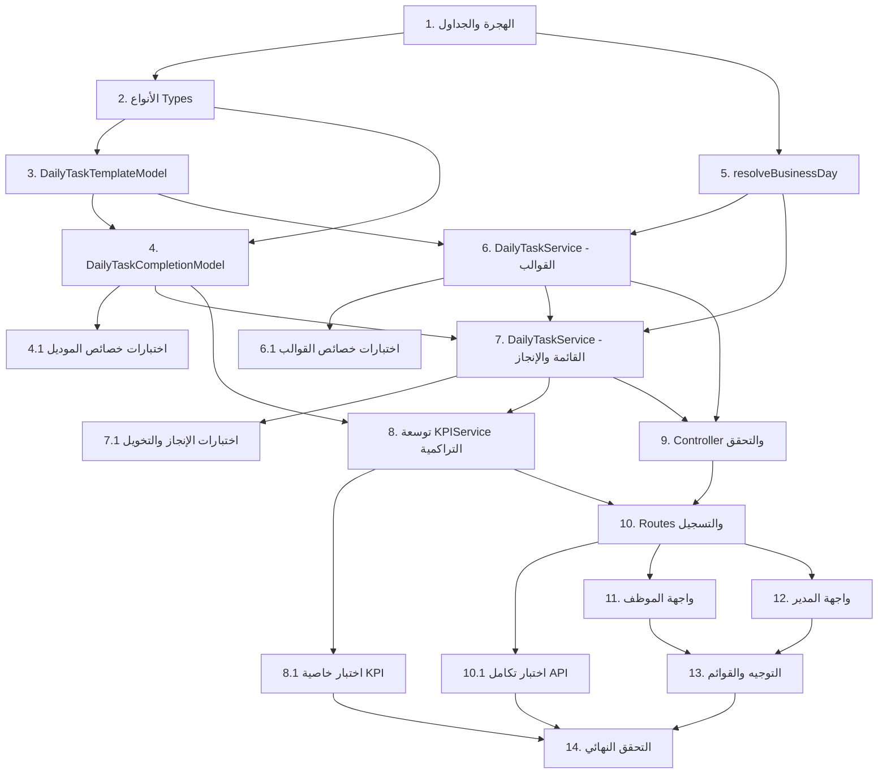

# Implementation Plan: المهام اليومية الثابتة (Recurring Daily Tasks)

## Overview

خطة التنفيذ مرتّبة تصاعديًا بحيث تبني كل مهمة على ما قبلها: قاعدة البيانات → الموديل → الخدمة → تكامل KPI → API → الواجهة → التكامل النهائي. كل مهمة تشير إلى المتطلبات التي تحققها من `requirements.md`، وتلتزم بالمعمارية المختارة في `design.md` (قالب ثابت + سجل إنجاز لكل يوم، جداول منفصلة عن `tasks`/`orders`، حساب KPI تراكمي).

## Tasks

- [x] 1. تهيئة الهجرة (Migration) وجداول قاعدة البيانات
  - إنشاء `src/migrations/add-recurring-daily-tasks.ts` بنمط `add-administrative-procedures.ts` (SQL خام عبر `pool`).
  - إنشاء جدول `daily_task_templates` (id, title, assigned_to FK→users, sequence_order, is_active, deleted_at, created_by FK→users, created_at, updated_at) + فهرس `(assigned_to, is_active, sequence_order)`.
  - إنشاء جدول `daily_task_completions` (id, template_id FK→daily_task_templates, business_day DATE, is_completed, marked_by FK→users, marked_at, created_at, updated_at) + قيد `UNIQUE(template_id, business_day)` + فهارس `(business_day, template_id)` و`(template_id)`.
  - إدراج صلاحيتين جديدتين في `permissions`: `daily_tasks.manage` و`daily_tasks.view_all` (بشكل idempotent مع `ON CONFLICT`).
  - تسجيل الهجرة في مُشغّل الهجرات القائم وتشغيلها للتأكد من نجاحها دون لمس جداول `tasks`/`orders`.
  - _Requirements: 6.1, 6.2, 7.1_

- [x] 2. تعريف الأنواع (Types) للمهام اليومية
  - إضافة واجهات TypeScript في `src/types/management` لـ `DailyTaskTemplate` و`DailyTaskCompletion` وعنصر القائمة المُشتق `DailyChecklistItem`.
  - _Requirements: 1.1, 3.1, 4.1_

- [x] 3. تنفيذ `DailyTaskTemplateModel`
  - إنشاء `src/models/management/DailyTaskTemplate.ts` (static class، SQL خام) بنمط `TaskModel`.
  - الدوال: `create`، `findById`، `findByAssignee(userId, { activeOnly })` مرتبة بـ `sequence_order`، `getMaxSequence(userId)`، `update(id, updates)`، `reorder(userId, orderedIds[])`، `softDelete(id)` (تعيين `is_active=false`/`deleted_at` دون لمس سجلات الإنجاز).
  - _Requirements: 1.1, 1.3, 2.1, 2.2, 2.3, 2.4, 3.1, 3.2_

- [x] 4. تنفيذ `DailyTaskCompletionModel`
  - إنشاء `src/models/management/DailyTaskCompletion.ts`.
  - `getChecklist(userId, businessDay)` عبر LEFT JOIN (القوالب المُفعّلة للموظف النشط ⋈ سجلات إنجاز اليوم) مرتّبة بـ `sequence_order`، مع "غير مُنجز" عند غياب السجل.
  - `upsertCompletion(templateId, businessDay, isCompleted, markedBy)` عبر `INSERT ... ON CONFLICT (template_id, business_day) DO UPDATE`.
  - `findCompletion(templateId, businessDay)`، و`countCompletedForUser(userId)` (إجمالي `is_completed=true` عبر كل الأيام)، و`countExpectedItemsForUser(userId)` (إجمالي الأيام التشغيلية المنقضية لكل قالب نشط — حساب تراكمي مُشتق).
  - _Requirements: 3.1, 3.2, 3.3, 4.1, 4.2, 4.4, 8.1, 8.2, 8.3_

- [x] 4.1 اختبارات خصائص للموديل (اشتقاق القائمة + idempotency + استقلال الأيام)
  - إضافة `fast-check` إلى تبعيات التطوير.
  - كتابة اختبارات الخصائص 1، 4، 5، 12 مع طبقة موديل in-memory/mock (≥100 تكرار، ووسم كل اختبار بتعليق الخاصية).
  - _Requirements: 3.1, 3.2, 3.3, 4.3, 4.4, 8.1, 8.2, 8.3, 2.4_

- [x] 5. تنفيذ دالة اليوم التشغيلي `resolveBusinessDay`
  - في `DailyTaskService` (أو util مشترك): تحويل أي طابع زمني إلى يوم تقويمي حتمي وفق منطقة زمنية مرجعية ثابتة `DAILY_TASK_TIMEZONE`.
  - كتابة اختبار الخاصية 6 (حتمية اليوم التشغيلي، بما فيها قيم قرب منتصف الليل).
  - _Requirements: 3.4, 8.4_

- [x] 6. تنفيذ `DailyTaskService` — إدارة القوالب
  - إنشاء `src/services/management/DailyTaskService.ts`.
  - `createTemplate` (تفعيل افتراضي true، ترتيب افتراضي بعد آخر قالب، تحقق وجود الموظف، رفض نقص العنوان/الموظف).
  - `updateTemplate` (عنوان/إسناد/تفعيل، خطأ إن لم يوجد القالب)، `reorderTemplates`، `deleteTemplate` (حذف منطقي).
  - تطبيق تحقق الصلاحية `daily_tasks.manage` عبر `PermissionService`.
  - _Requirements: 1.1, 1.2, 1.3, 1.4, 1.5, 2.1, 2.2, 2.3, 2.4, 2.5, 7.1_

- [x] 6.1 اختبارات خصائص لإدارة القوالب
  - الخصائص 2 (إعادة التفعيل)، 10 (افتراضات الإنشاء)، 11 (إعادة الترتيب = التبديلة المُرسلة).
  - _Requirements: 1.1, 1.2, 1.3, 2.3, 8.6_

- [x] 7. تنفيذ `DailyTaskService` — قائمة التحقق والإنجاز
  - `getChecklistFor(targetUserId, requesterId, date?)` مع قواعد التخويل (الموظف يرى قائمته؛ موظف آخر يتطلب `daily_tasks.view_all`).
  - `markComplete` / `markIncomplete`: تحقق ملكية القالب للطالب (رفض 403 خلاف ذلك)، رفض اليوم المستقبلي، UPSERT الحالة، ثم استدعاء `KPIService.calculateUserKPI(userId)`.
  - _Requirements: 3.4, 4.1, 4.2, 4.3, 4.4, 4.5, 4.6, 7.2, 7.3, 7.4_

- [x] 7.1 اختبارات خصائص للإنجاز والتخويل
  - الخصائص 3 (round-trip)، 9 (إنفاذ التخويل).
  - اختبارات وحدة: رفض اليوم المستقبلي (4.6)، رفض قالب غير مملوك (4.5).
  - _Requirements: 4.1, 4.2, 4.5, 4.6, 7.1, 7.3_

- [x] 8. توسعة `KPIService` بالحساب التراكمي للمهام اليومية
  - توسعة `calculateUserKPI(userId)` لإضافة مصدر رابع تراكمي: المُنجَز = `countCompletedForUser`؛ الإجمالي = `countExpectedItemsForUser`، ويُطوى **بالإضافة** إلى أعداد المهام العادية/الإدارية دون استبدالها.
  - توسعة `getAllUsersKPI` و`getDashboardSummary` بنفس الحساب التراكمي عبر `LEFT JOIN LATERAL` بنفس النمط القائم.
  - ضمان `completed ≤ total` ونسبة `round(completed/total*100)` ضمن [0,100] و0 عند `total=0`.
  - _Requirements: 5.1, 5.2, 5.3, 5.4_

- [x] 8.1 اختبار خاصية تكامل KPI التراكمي
  - الخاصية 8 (إضافة لا استبدال، تراكمي، حصر النسبة، احتساب الأيام غير المُعلَّمة في المقام).
  - _Requirements: 5.1, 5.2, 5.3_

- [x] 9. تنفيذ الـ Controller والتحقق (Validation)
  - إنشاء `DailyTaskController` تحت `src/controllers/management/` بنمط المشروع، مع تغليف الاستجابة `{ success, data|error, timestamp }`.
  - مخططات `joi` للتحقق من مدخلات الإنشاء/التعديل/إعادة الترتيب/الإنجاز ورسائل الأخطاء وفق جدول Error Handling.
  - _Requirements: 1.4, 1.5, 2.5, 4.5, 4.6, 7.1, 7.3_

- [x] 10. تعريف المسارات (Routes) وتسجيلها
  - إنشاء `src/routes/management/daily-tasks.ts` وتسجيله في `routes/management/index.ts` تحت `/daily-tasks`.
  - المسارات: `POST/PUT/PATCH(reorder)/DELETE/GET templates`، `GET checklist`، `POST .../complete`، `POST .../uncomplete`.
  - تطبيق `authenticate` عامًّا و`requirePermission('daily_tasks.manage')` على عمليات الإدارة.
  - _Requirements: 1.1, 2.1, 2.3, 2.4, 3.1, 4.1, 4.2, 7.1_

- [ ] 10.1 اختبار تكامل للـ API (مثال شامل)
  - تسلسل: إنشاء قالب → عرض قائمة → وضع علامة → التحقق من ظهور الأثر في `user_kpi` → عدم تغيّر صفوف `tasks`/`orders` (الخاصية 7).
  - _Requirements: 3.5, 5.1, 6.2, 6.4_

- [x] 11. واجهة الموظف — `MyDailyChecklistPage.tsx`
  - إنشاء `MCMS-FRONT/src/components/MyDailyChecklistPage.tsx` بنمط `MyAdminTasksPage.tsx` (framer-motion، lucide-react، عميل `api`).
  - جلب `GET /api/management/daily-tasks/checklist`، عرض كل عنصر بمربع اختيار، نقر يستدعي `complete`/`uncomplete` مع تحديث متفائل وتراجع عند الخطأ، وحالتي تحميل/فراغ.
  - _Requirements: 3.1, 3.2, 3.3, 4.1, 4.2_

- [x] 12. واجهة المدير — `DailyTasksManagePage.tsx`
  - إنشاء `MCMS-FRONT/src/components/DailyTasksManagePage.tsx`: اختيار موظف، عرض قوالبه مرتّبة، نموذج إضافة، تعديل سطري، تبديل تفعيل، حذف، وإعادة ترتيب (سحب/إفلات يرسل `ordered_ids[]`).
  - إظهار مشروط حسب صلاحية `daily_tasks.manage`.
  - _Requirements: 1.1, 2.1, 2.2, 2.3, 2.4, 7.1_

- [x] 13. ربط التوجيه والقوائم في الواجهة
  - إضافة مساري الصفحتين في `App.tsx` وعناصر القائمة في `MainLayout.tsx` وفق النمط القائم.
  - التأكد من أن `DashboardPage.tsx` تعرض الأرقام المُوسَّعة من `user_kpi` دون تغيير هيكلي.
  - _Requirements: 3.1, 5.4_

- [x] 14. التحقق النهائي وتشغيل كامل الاختبارات
  - تشغيل بناء الـ backend (`tsc`/build) واختبارات Jest + fast-check والتأكد من نجاحها.
  - تشغيل بناء الـ frontend (Vite) والتأكد من خلوّه من الأخطاء.
  - تنفيذ سيناريو يدوي قصير: تعريف قالبين لموظف → ظهورهما تلقائيًا كقائمة → وضع صح → انعكاس النسبة في الداشبورد.
  - _Requirements: 3.5, 5.1, 5.4, 6.2, 6.3, 6.4_

## Task Dependency Graph

```json
{
  "waves": [
    { "wave": 1, "tasks": ["1"] },
    { "wave": 2, "tasks": ["2", "5"] },
    { "wave": 3, "tasks": ["3"] },
    { "wave": 4, "tasks": ["4", "6"] },
    { "wave": 5, "tasks": ["4.1", "6.1", "7"] },
    { "wave": 6, "tasks": ["7.1", "8"] },
    { "wave": 7, "tasks": ["8.1", "9"] },
    { "wave": 8, "tasks": ["10"] },
    { "wave": 9, "tasks": ["10.1", "11", "12"] },
    { "wave": 10, "tasks": ["13"] },
    { "wave": 11, "tasks": ["14"] }
  ]
}
```



## Notes

- اختبارات الخصائص تستخدم `fast-check` (تُضاف في المهمة 4.1) بحدّ أدنى 100 تكرار، ويُوسَم كل اختبار بتعليق `// Feature: recurring-daily-tasks, Property {n}: {text}` مرتبطًا بالخصائص الـ12 في `design.md`.
- منطق الأعمال يُختبَر مع طبقة موديل in-memory/mock لعزله عن قاعدة البيانات؛ وتُضاف 1–3 اختبارات تكامل واقعية (المهمتان 10.1 و14).
- لا تُجرى أي عمليات على جداول `tasks`/`orders`؛ كل التعديلات على المخطط هي إضافة جداول/فهارس/صلاحيات فقط (المهمة 1).
- المهام الفرعية المُرقّمة (4.1، 6.1، 7.1، 8.1، 10.1) هي مهام اختبار ترتبط مباشرة بالمهمة الأم.
```
